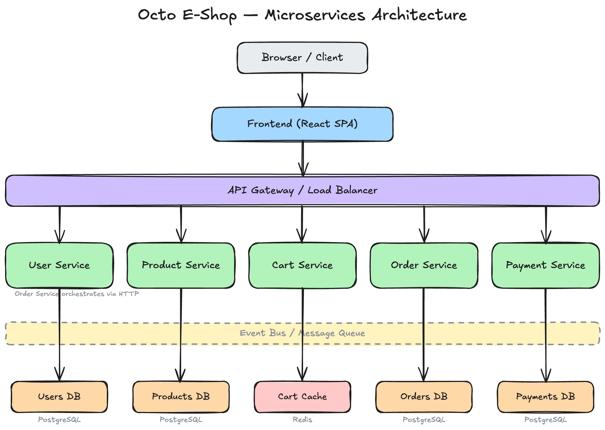

# Octo E-Shop 🚲

[](https://github.com/edinc/octo-eshop-demo/actions/workflows/ci.yml)
[](https://github.com/edinc/octo-eshop-demo/actions/workflows/build-push.yml)
[](https://github.com/edinc/octo-eshop-demo/actions/workflows/deploy.yml)

A bicycle e-commerce platform built with microservices architecture, deployed on Azure Kubernetes Service.



## Technology Stack

| Layer              | Technology                               |
| ------------------ | ---------------------------------------- |
| **Frontend**       | React, Vite, Tailwind CSS, Redux Toolkit |
| **Backend**        | Node.js, TypeScript, Express             |
| **Databases**      | PostgreSQL (Prisma ORM), Redis           |
| **Infrastructure** | Azure AKS, Terraform                     |
| **CI/CD**          | GitHub Actions, Helm                     |

## Services

| Service             | Description                                  |
| ------------------- | -------------------------------------------- |
| **frontend**        | React SPA — product browsing, cart, checkout |
| **user-service**    | Authentication, profiles, JWT tokens         |
| **product-service** | Bicycle catalog, inventory management        |
| **cart-service**    | Shopping cart (Redis-backed)                 |
| **order-service**   | Order orchestration across services          |
| **payment-service** | Payment processing (mock gateway)            |

## Quick Start

### GitHub Codespaces (recommended)

[](https://codespaces.new/edinc/octo-eshop-demo)

The devcontainer provides a ready-to-code environment with all tools and extensions pre-installed. Once the container is ready:

```bash
# Start databases and all services
docker-compose up -d

# Run tests
npm test
```

### Local development with Docker Compose

```bash
# Install dependencies
npm install

# Start all services (databases, backend, frontend, API gateway)
docker-compose up -d

# Run tests
npm test

# Build all services
npm run build
```

### From scratch (new Azure environment)

```bash
# One-time bootstrap: creates Terraform state backend + Azure SP + GitHub secrets
./scripts/bootstrap-backend.sh

# Then trigger infrastructure provisioning (includes cluster add-ons setup)
gh workflow run infrastructure.yml -f environment=dev -f action=apply
```

## Project Structure

```
octo-eshop-demo/
├── services/               # Microservices (npm workspaces)
│   ├── frontend/           # React SPA
│   ├── user-service/       # Authentication & profiles
│   ├── product-service/    # Bicycle catalog
│   ├── cart-service/       # Shopping cart (Redis)
│   ├── order-service/      # Order lifecycle
│   └── payment-service/    # Mock payment gateway
├── shared/                 # Shared packages
│   ├── types/              # @octo-eshop/types
│   └── utils/              # @octo-eshop/utils
├── infrastructure/         # Terraform (Azure)
├── kubernetes/             # K8s manifests & cluster setup
├── helm/                   # Helm charts (one per service)
├── .devcontainer/          # GitHub Codespaces / devcontainer config
├── docs/                   # Architecture & pipeline docs
└── scripts/                # Bootstrap & utility scripts
```

## Documentation

| Document                                                 | Description                                             |
| -------------------------------------------------------- | ------------------------------------------------------- |
| [📖 Demo Site](https://edinc.github.io/octo-eshop-demo/) | Interactive Copilot demo guides and presenter resources |
| [Azure Architecture](docs/azure-architecture.md)         | Infrastructure design, Azure services, network topology |
| [CI/CD Pipeline](docs/cicd-pipeline.md)                  | Workflows, deployment strategy, operational runbook     |

## License

[MIT](LICENSE)
