# CI/CD Pipeline Documentation

> Complete guide to the Octo E-Shop continuous integration, delivery, and infrastructure workflows.

## Table of Contents

- [Overview](#overview)
- [Architecture Diagram](#architecture-diagram)
- [Workflow Inventory](#workflow-inventory)
- [Pipeline Flows](#pipeline-flows)
  - [CI Pipeline](#1-ci-pipeline)
  - [Build & Deploy Pipeline](#2-build--deploy-pipeline)
  - [Infrastructure Pipeline](#3-infrastructure-pipeline)
  - [Rollback Pipeline](#4-rollback-pipeline)
- [Environment Strategy](#environment-strategy)
- [Secrets Management](#secrets-management)
- [Deployment Details](#deployment-details)
- [Operational Runbook](#operational-runbook)

---

## Overview

The Octo E-Shop uses **GitHub Actions** for CI/CD with a progressive deployment model across three environments. The platform consists of 6 microservices deployed to **Azure Kubernetes Service (AKS)** via **Helm charts**, with infrastructure provisioned by **Terraform**.

```
Code Push → CI Validation → Build & Push Images → Deploy Dev → Deploy Staging → Deploy Production
                                                      ↑              ↑               ↑
                                                   automatic    approval gate    approval gate
```

---

## Architecture Diagram


---

## Workflow Inventory

| Workflow                  | File                   | Type         | Trigger                          |
| ------------------------- | ---------------------- | ------------ | -------------------------------- |
| **CI Pipeline**           | `ci.yml`               | Standalone   | Push, PR                         |
| **Build & Push Images**   | `build-push.yml`       | Orchestrator | Push (service changes), manual   |
| **Deploy to Environment** | `deploy.yml`           | Reusable     | Called by build-push, manual     |
| **Infrastructure**        | `infrastructure.yml`   | Orchestrator | Push (terraform changes), manual |
| **Terraform Deploy**      | `terraform-deploy.yml` | Reusable     | Called by infrastructure         |
| **Cluster Setup**         | `cluster-setup.yml`    | Reusable     | Called by infrastructure (apply) |
| **Rollback**              | `rollback.yml`         | Standalone   | Manual only                      |

### Workflow Call Graph


---

## Pipeline Flows

### 1. CI Pipeline

**File:** `.github/workflows/ci.yml`
**Purpose:** Validates code quality, runs tests, and checks infrastructure definitions.


**Triggers:**

- `push` to `main`, `develop`, `feature/**` branches
- `pull_request` to `main`, `develop`

**What it validates:**

- ESLint + Prettier formatting
- TypeScript compilation (all services)
- Unit tests with PostgreSQL + Redis service containers
- Docker image builds (PR only)
- Terraform `validate` and `fmt`
- Helm chart linting
- Security scanning

---

### 2. Build & Deploy Pipeline

**File:** `.github/workflows/build-push.yml` → calls `deploy.yml`
**Purpose:** Builds Docker images for changed services and progressively deploys through environments.


**Triggers:**

- `push` to `main` or `develop` with changes in `services/**`, `shared/**`, or the workflow itself
- `workflow_dispatch` with option to build all services

**Smart Change Detection:**
The pipeline uses [dorny/paths-filter](https://github.com/dorny/paths-filter) to detect which services changed. Only modified services are rebuilt. If `shared/**` changes, **all services** are rebuilt.

**Image Tagging Strategy:**

The image tag is resolved once in a dedicated `resolve-tag` job _before_ the build matrix runs, ensuring all services use the same consistent tag.

| Branch              | Tags                                      |
| ------------------- | ----------------------------------------- |
| `main`              | `latest`, `<commit-sha-short>`            |
| `develop` / feature | `<branch>-<commit-sha-short>`, `<branch>` |

> **Note:** Deployments always use the `<commit-sha-short>` tag (not `latest`) to ensure traceability.

**Manual Dispatch:**
Can be triggered manually with `build_all: true` to force-build all 6 services regardless of changes.

#### Deploy Sub-Workflow

**File:** `.github/workflows/deploy.yml`

Each environment deployment follows the same steps:


**Services deployed (in order):**

1. `network-policies` (Helm chart for K8s NetworkPolicy resources)
2. `user-service`
3. `product-service`
4. `cart-service`
5. `order-service`
6. `payment-service`
7. `frontend`

**Secret injection strategy:**
Secrets are injected via `kubectl create secret` (not Helm `--set`) to avoid shell escaping issues with connection strings containing special characters. After secrets are created, deployments are restarted to pick them up.

---

### 3. Infrastructure Pipeline

**File:** `.github/workflows/infrastructure.yml` → calls `terraform-deploy.yml`
**Purpose:** Provisions and manages Azure infrastructure via Terraform.


**Triggers:**

- `push` to `main` with changes in `infrastructure/terraform/**` → plans all 3 environments (validation only)
- `workflow_dispatch` → select environment (dev/staging/production) and action (plan/apply)

#### Terraform Deploy Sub-Workflow

**File:** `.github/workflows/terraform-deploy.yml`


**Post-Apply Automation:**

After `terraform apply`, two additional steps run automatically:

1. **Secrets Sync** — reads Terraform outputs and Key Vault secrets, then sets them as GitHub Actions environment secrets via `gh secret set`. Requires a `GH_TOKEN` secret (GitHub PAT with `repo` scope).

2. **Cluster Setup** (`cluster-setup.yml`) — configures AKS cluster-level dependencies:
   - Installs **ingress-nginx** controller via Helm
   - Installs **External Secrets Operator** (ESO) via Helm
   - Creates a **managed identity** with federated credentials for workload identity
   - Creates a **ClusterSecretStore** CRD pointing to Azure Key Vault

**Terraform State Backend:**
Each environment stores state in the shared Azure Storage Account:

- Container: `tfstate`
- Keys: `dev.terraform.tfstate`, `staging.terraform.tfstate`, `production.terraform.tfstate`
- Authentication: Azure AD (via service principal)

**Resources provisioned per environment:**

| Resource                         | Module                   |
| -------------------------------- | ------------------------ |
| Resource Group                   | `azurerm_resource_group` |
| Virtual Network + Subnets + NSGs | `modules/networking`     |
| AKS Cluster                      | `modules/aks`            |
| Container Registry               | `modules/acr`            |
| PostgreSQL Flexible Server (×3)  | `modules/postgresql`     |
| Redis Cache                      | `modules/redis`          |
| Service Bus Namespace            | `modules/servicebus`     |
| Key Vault + Secrets              | `modules/keyvault`       |
| Storage Account                  | `modules/storage`        |
| Log Analytics + App Insights     | `modules/monitoring`     |

---

### 4. Rollback Pipeline

**File:** `.github/workflows/rollback.yml`
**Purpose:** Emergency rollback of Helm releases to a previous revision.


**Inputs:**

- `environment`: dev / staging / production
- `service`: specific service name or `all` (rolls back all 6)
- `revision`: optional Helm revision number (defaults to previous)

---

## Environment Strategy

```mermaid
graph LR
    DEV[🟢 Dev<br/>Auto-deploy] -->|approval gate| STG[🟡 Staging<br/>Manual approval]
    STG -->|approval gate| PRD[🔴 Production<br/>Manual approval]

    style DEV fill:#4CAF50,color:white
    style STG fill:#FF9800,color:white
    style PRD fill:#F44336,color:white
```



| Property               | Dev                      | Staging                  | Production                          |
| ---------------------- | ------------------------ | ------------------------ | ----------------------------------- |
| **Namespace**          | `octo-eshop-dev`         | `octo-eshop-staging`     | `octo-eshop-production`             |
| **Approval**           | None                     | Required (reviewer)      | Required (reviewer) + branch policy |
| **Branch restriction** | Any                      | `main` only              | `main` only                         |
| **Auto-deploy**        | ✅ Yes                   | ❌ No                    | ❌ No                               |
| **AKS nodes**          | 1 × Standard_D2s_v3      | 2 × Standard_D2s_v3      | 3 × Standard_D4s_v3                 |
| **PostgreSQL SKU**     | B_Standard_B1ms          | B_Standard_B1ms          | GP_Standard_D4s_v3                  |
| **Redis**              | Basic/C0                 | Basic/C0                 | Premium/P1                          |
| **ACR SKU**            | Basic                    | Standard                 | Premium                             |
| **Frontend access**    | LoadBalancer (public IP) | LoadBalancer (public IP) | LoadBalancer (public IP)            |

---

## Secrets Management

### Repository-Level Secrets

| Secret              | Description                                                               | Used By       |
| ------------------- | ------------------------------------------------------------------------- | ------------- |
| `AZURE_CREDENTIALS` | Service principal JSON (clientId, clientSecret, tenantId, subscriptionId) | All workflows |
| `ACR_LOGIN_SERVER`  | ACR login URL (shared across environments)                                | Build & Push  |
| `ACR_USERNAME`      | ACR admin username                                                        | Build & Push  |
| `ACR_PASSWORD`      | ACR admin password                                                        | Build & Push  |
| `GH_TOKEN`          | GitHub PAT with `repo` scope (for automated secrets sync)                 | Terraform     |

### Environment-Scoped Secrets

Each GitHub Environment (dev, staging, production) has its own set of secrets. These are **automatically synced** from Azure Key Vault after `terraform apply`:

| Secret                         | Description                                      |
| ------------------------------ | ------------------------------------------------ |
| `AKS_RESOURCE_GROUP`           | Azure resource group for AKS                     |
| `AKS_CLUSTER_NAME`             | AKS cluster name                                 |
| `USER_DATABASE_URL`            | PostgreSQL connection string for user-service    |
| `PRODUCT_DATABASE_URL`         | PostgreSQL connection string for product-service |
| `ORDER_DATABASE_URL`           | PostgreSQL connection string for order-service   |
| `REDIS_URL`                    | Redis connection string (`rediss://...`)         |
| `SERVICEBUS_CONNECTION_STRING` | Azure Service Bus connection string              |
| `JWT_SECRET`                   | JWT signing secret                               |

### How secrets flow to services


> **Note:** Production uses External Secrets Operator (ESO) with Azure Workload Identity to sync secrets directly from Key Vault to Kubernetes, bypassing GitHub secrets for sensitive values.

---

## Deployment Details

### Helm Charts

Each microservice has its own Helm chart with per-environment value overrides:

```
helm/charts/
├── cart-service/
│   ├── values.yaml              # Base defaults
│   ├── values-dev.yaml          # Dev overrides
│   ├── values-staging.yaml      # Staging overrides
│   └── values-production.yaml   # Production overrides
├── frontend/
├── network-policies/
├── order-service/
├── payment-service/
├── product-service/
└── user-service/
```

The deploy workflow applies values in this order:

```bash
helm upgrade --install <service> ./helm/charts/<service> \
  --namespace octo-eshop-<env> \
  -f values.yaml \
  -f values-<env>.yaml \
  --set image.tag=<tag> \
  --set image.repository=<acr>/<service>
```

### Network Policies

The `network-policies` chart is deployed **first** in every environment. It defines Kubernetes NetworkPolicy resources that restrict pod-to-pod communication and egress to database subnets.

---

## Operational Runbook

### Bootstrap from scratch

To recreate the entire platform from zero:

```bash
# 1. One-time bootstrap: Terraform backend + Azure SP + GitHub secrets
./scripts/bootstrap-backend.sh --subscription <sub-id> --repo <owner/repo>

# 2. Provision infrastructure (creates AKS, databases, Key Vault, etc.)
#    This also syncs secrets to GitHub and installs cluster add-ons
gh workflow run infrastructure.yml -f environment=dev -f action=apply

# 3. Build and deploy all services
gh workflow run build-push.yml -f build_all=true
```

### Deploy a single service manually

```bash
# Trigger build-push for all services
gh workflow run build-push.yml -f build_all=true

# Or deploy to a specific environment directly
gh workflow run deploy.yml -f environment=dev -f image_tag=latest
```

### Provision infrastructure

```bash
# Plan first (safe - no changes applied)
gh workflow run infrastructure.yml -f environment=staging -f action=plan

# Apply after reviewing plan output
gh workflow run infrastructure.yml -f environment=staging -f action=apply
```

### Emergency rollback

```bash
# Rollback all services in staging to previous revision
gh workflow run rollback.yml -f environment=staging -f service=all

# Rollback specific service to specific revision
gh workflow run rollback.yml -f environment=production -f service=user-service -f revision=3
```

### Check deployment status

```bash
# List recent workflow runs
gh run list --limit 10

# Watch a specific run
gh run watch <run-id>

# View logs for failed jobs
gh run view <run-id> --log-failed
```

### End-to-End Flow: Feature to Production

```mermaid
sequenceDiagram
    actor Dev as Developer
    participant GH as GitHub
    participant CI as CI Pipeline
    participant Build as Build & Push
    participant DevEnv as Dev Environment
    participant Stg as Staging
    participant Prod as Production

    Dev->>GH: Create feature branch
    Dev->>GH: Push code changes
    GH->>CI: Trigger CI (lint, test, build)
    CI-->>GH: ✅ All checks pass

    Dev->>GH: Open PR to main
    GH->>CI: Trigger CI (+ Docker build test)
    CI-->>GH: ✅ PR checks pass

    Dev->>GH: Merge PR to main
    GH->>Build: Trigger Build & Push
    Build->>Build: Detect changed services
    Build->>Build: Build & push images to ACR
    Build->>Build: Trivy security scan

    Build->>DevEnv: Deploy to Dev (automatic)
    DevEnv-->>Build: ✅ Healthy

    Build->>Stg: Request staging deployment
    Note over Stg: ⏸️ Waiting for approval
    Dev->>Stg: Approve deployment
    Stg-->>Build: ✅ Healthy

    Build->>Prod: Request production deployment
    Note over Prod: ⏸️ Waiting for approval
    Dev->>Prod: Approve deployment
    Prod-->>Build: ✅ Deployed to production
```


