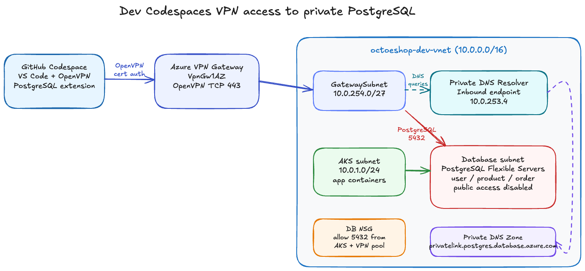

# Dev Codespaces VPN Access

The dev PostgreSQL Flexible Servers are private-only. GitHub Codespaces cannot reach them directly over the public internet, so the dev environment includes an Azure Point-to-Site VPN path into the dev VNet.

## Architecture



Open the editable architecture diagram in [diagrams/dev-codespaces-vpn-architecture.excalidraw](diagrams/dev-codespaces-vpn-architecture.excalidraw) with Excalidraw or the VS Code Excalidraw extension.

The high-level flow is:

1. The Codespace runs an OpenVPN client and authenticates to the Azure VPN Gateway with the generated client certificate.
2. Azure assigns the Codespace a VPN client IP from `172.31.250.0/24`.
3. PostgreSQL traffic to the private dev database FQDNs routes through the VPN into `octoeshop-dev-vnet`.
4. DNS for private PostgreSQL names is sent to the Private DNS Resolver inbound endpoint at `10.0.253.4`.
5. The dev database NSG allows PostgreSQL `5432` from both the AKS subnet and the VPN client pool.

## What Terraform creates

The dev networking module enables these resources only for `dev`:

| Resource                              | Purpose                                                        |
| ------------------------------------- | -------------------------------------------------------------- |
| `GatewaySubnet`                       | Required subnet for Azure VPN Gateway                          |
| Azure VPN Gateway                     | OpenVPN Point-to-Site access into the dev VNet                 |
| VPN public IP                         | Public endpoint for authenticated VPN clients                  |
| Private DNS Resolver inbound endpoint | DNS server for VPN clients so private PostgreSQL names resolve |
| DB NSG rule                           | Allows PostgreSQL `5432` from the VPN client address pool      |

PostgreSQL public network access remains disabled.

New Azure VPN gateways use the `VpnGw1AZ` SKU and a zone-redundant Standard public IP by default because non-AZ `VpnGw1`-`VpnGw5` gateway SKUs are no longer accepted for new gateway creation.

## Generate certificate material

Azure certificate-authenticated Point-to-Site VPN needs a trusted root certificate on the gateway and a client certificate signed by that root.

```bash
./scripts/generate-dev-vpn-cert.sh
```

This writes private certificate material under `.vpn/dev-p2s/`, which is ignored by Git. Store the root public certificate data as a repository-level GitHub Actions secret:

```bash
gh secret set DEV_P2S_VPN_ROOT_CERTIFICATE_PUBLIC_DATA \
  --body "$(cat .vpn/dev-p2s/root-cert-data.txt)"
```

This secret must be repository-level, not environment-scoped, because Terraform plan jobs run before GitHub environment binding is applied. Never commit the generated `.key`, `.crt`, `.csr`, or `.srl` files.

## Apply the dev infrastructure

The VPN is opt-in so a missing certificate secret does not break unrelated Terraform plans. Enable it with a repository-level GitHub Actions variable after the secret is set:

```bash
gh variable set DEV_ENABLE_POINT_TO_SITE_VPN --body true
```

Then trigger the dev infrastructure workflow:

```bash
gh workflow run infrastructure.yml -f environment=dev -f action=apply
```

For local Terraform runs:

```bash
cd infrastructure/terraform/environments/dev
export TF_VAR_enable_point_to_site_vpn=true
export TF_VAR_p2s_vpn_root_certificate_public_data="$(cat ../../../../.vpn/dev-p2s/root-cert-data.txt)"
terraform init
terraform plan -out=tfplan
terraform apply tfplan
```

VPN gateway creation can take a long time on the first apply.

## Test from Codespaces

Do the VPN client test from inside a Codespace, not from your local machine. The Azure infrastructure is already deployed for dev, but the OpenVPN profile, client certificate, and key are intentionally not committed.

Azure CLI sign-in is **not required inside Codespaces** for the VPN client test. Some tenants block interactive `az login` from browser-based development environments through Conditional Access, and the Codespaces image can also have Azure CLI module packaging differences. Treat the Codespace as a VPN client only: prepare Azure-derived inputs from a local/admin-approved machine, store them as Codespaces secrets, then connect from the Codespace without calling Azure APIs.

### 1. Prepare Codespaces VPN secrets from a local/admin machine

Run this from a machine where Azure CLI sign-in is allowed and where the `.vpn/dev-p2s/` certificate material that matches the deployed VPN gateway is available:

```bash
./scripts/prepare-dev-vpn-codespaces-secrets.sh
```

The helper:

1. Downloads the generated Azure OpenVPN client profile from `octoeshop-dev-p2s-vng`.
2. Adds the Private DNS Resolver inbound endpoint (`10.0.253.4`) to the profile.
3. Stores the profile, client certificate, client key, DNS server, and current dev PostgreSQL hostnames as repository Codespaces secrets.

It sets these Codespaces secrets:

| Secret                        | Purpose                                             |
| ----------------------------- | --------------------------------------------------- |
| `DEV_P2S_VPN_PROFILE_B64`     | Base64-encoded Azure OpenVPN profile                |
| `DEV_P2S_VPN_CLIENT_CERT_B64` | Base64-encoded client certificate                   |
| `DEV_P2S_VPN_CLIENT_KEY_B64`  | Base64-encoded client private key                   |
| `DEV_P2S_VPN_DNS_SERVER`      | Private DNS Resolver inbound endpoint, `10.0.253.4` |
| `DEV_POSTGRES_USER_HOST`      | Current dev user database FQDN                      |
| `DEV_POSTGRES_PRODUCT_HOST`   | Current dev product database FQDN                   |
| `DEV_POSTGRES_ORDER_HOST`     | Current dev order database FQDN                     |

Stop and restart existing Codespaces after setting or changing Codespaces secrets. GitHub injects Codespaces secrets when the Codespace starts; already-running Codespaces do not automatically receive newly-created secrets.

### 2. Install OpenVPN tools in the Codespace

```bash
sudo apt-get update
sudo apt-get install -y openvpn dnsutils postgresql-client netcat-openbsd
```

### 3. Connect the VPN from the Codespace

Run the connection helper:

```bash
./scripts/connect-dev-vpn-codespace.sh
```

The helper decodes the Codespaces secrets into `.vpn/dev-p2s/`, writes a Codespaces-specific OpenVPN profile, starts OpenVPN, checks for `Initialization Sequence Completed`, resolves the dev PostgreSQL hostnames through `10.0.253.4`, and adds a temporary managed block to `/etc/hosts` so normal PostgreSQL tools use the private IPs.

Do not commit files under `.vpn/`.

### 4. Verify private DNS and PostgreSQL TCP access

If the connect helper completes successfully, the VPN is connected and user database TCP connectivity has already been checked. To rerun the checks manually:

```bash
dig @"${DEV_P2S_VPN_DNS_SERVER:-10.0.253.4}" "$DEV_POSTGRES_USER_HOST"
nc -vz "$DEV_POSTGRES_USER_HOST" 5432
```

If `nc` fails after DNS resolves, confirm the dev PostgreSQL servers are `Ready`. They are commonly stopped by the nightly shutdown schedule and must be started before testing.

### 5. Connect with the VS Code PostgreSQL extension

After the VPN is connected, install the PostgreSQL extension in VS Code/Codespaces and connect to the private dev database FQDNs:

| Database | Host pattern                                             | Port   | SSL     |
| -------- | -------------------------------------------------------- | ------ | ------- |
| user     | `octoeshop-dev-user-db-*.postgres.database.azure.com`    | `5432` | require |
| product  | `octoeshop-dev-product-db-*.postgres.database.azure.com` | `5432` | require |
| order    | `octoeshop-dev-order-db-*.postgres.database.azure.com`   | `5432` | require |

Use the `pgadmin` username and the dev database passwords from your secure development secret source. The VPN provides the private network path to PostgreSQL; it does not make the dev Key Vault reachable unless Key Vault private access is added separately.

If you already have a connection string, the same host, database, user, password, and `sslmode=require` settings can be entered into the extension.

### 6. Disconnect when finished

```bash
./scripts/disconnect-dev-vpn-codespace.sh
```

## Network ranges

The default dev ranges are:

| Range             | Use                                      |
| ----------------- | ---------------------------------------- |
| `10.0.254.0/27`   | VPN `GatewaySubnet`                      |
| `10.0.253.0/28`   | Private DNS Resolver inbound endpoint    |
| `10.0.253.4`      | Private DNS Resolver inbound endpoint IP |
| `172.31.250.0/24` | VPN client address pool                  |

Change these variables if they overlap with a developer network or future Azure subnet plan.

## Certificate rotation

The helper script defaults certificates to 365 days. Before expiry, regenerate the certificate material, update the repository-level `DEV_P2S_VPN_ROOT_CERTIFICATE_PUBLIC_DATA` secret, and rerun the dev infrastructure apply:

```bash
./scripts/generate-dev-vpn-cert.sh
gh secret set DEV_P2S_VPN_ROOT_CERTIFICATE_PUBLIC_DATA \
  --body "$(cat .vpn/dev-p2s/root-cert-data.txt)"
gh workflow run infrastructure.yml -f environment=dev -f action=apply
```

Rerun `./scripts/prepare-dev-vpn-codespaces-secrets.sh` after rotation so Codespaces receives the regenerated OpenVPN profile, client certificate, and client key. Stop and restart existing Codespaces after the secret update. Distribute the regenerated client certificate and key to developers who need VPN access outside Codespaces.
